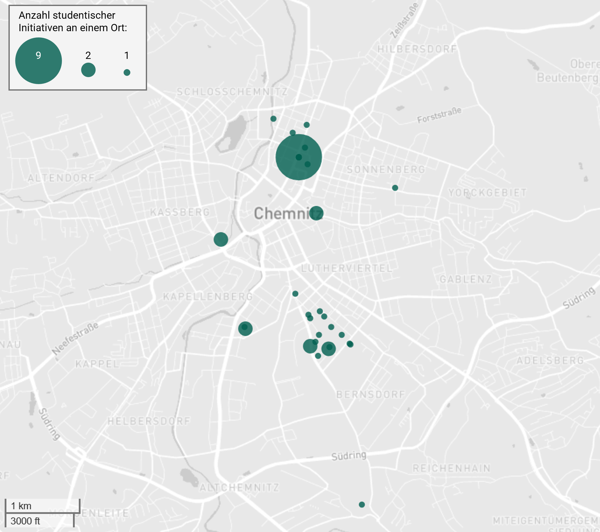
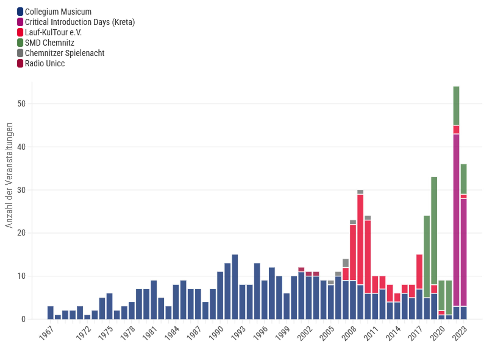
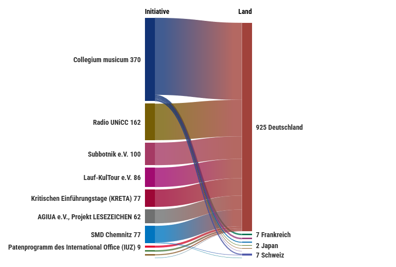
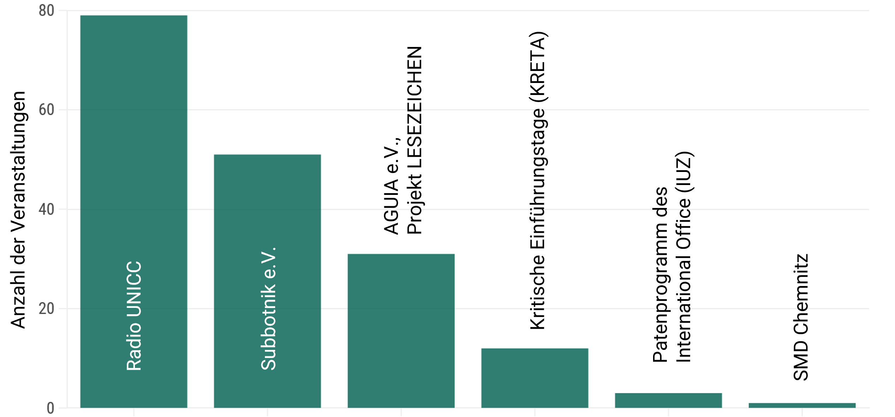
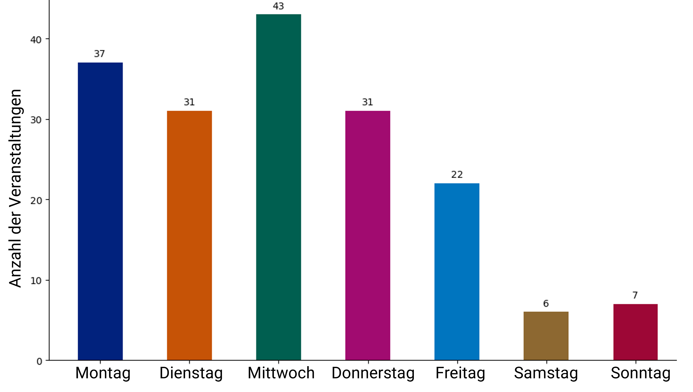

_work-in-progress_

# C the Unheard!

**Datenbasierte Kartierungen zivilgesellschaftlicher Diskurse in Chemnitz**

Zivilgesellschaftliche Aktivitäten prägen nicht nur die Chemnitzer Stadtöffentlichkeit sondern auch das Campusleben der TU Chemnitz nachhaltig. Dennoch fehlte bisher eine Datensammlung, die das vielfältige Engagement zivilgesellschaftlicher Akteure dokumentiert und sichtbar macht. Dabei gewinnt die Repräsentation durch Daten in einer pluralistischen, digitalen Gesellschaft an Bedeutung. Daten bilden weder Wahrheit noch Wirklichkeit objektiv ab, aber sie können als Argumente und Evidenzen eingesetzt werden, um wirksame Narrative zu etablieren. Wer oder was durch Daten repräsentiert wird, ist eine Frage der sozialen Teilhabe, der kollektiven Selbstwirksamkeit und der Sichtbarkeit im politischen Diskurs. 

Hier setzt das Lehr-Lern-Projekt [C the Unheard!](https://www.tu-chemnitz.de/phil/ifgk/dh/forschung/projekte/index.html) unter der Leitung der Juniorprofessur für Digital Humanities der TU Chemnitz an. In Zusammenarbeit mit zivilgesellschaftlichen Projektpartner:innen, Studierenden und Bürger:innen entstand eine exemplarische Datensammlung, die erstmals versucht, das zivilgesellschaftliche und vor allem studentische Engagement in Chemnitz datenbasiert zu erfassen. Was bedeutet es, Chemnitz mit und durch Daten zu sehen? Wie greifen zivilgesellschaftliche Aktivitäten auf dem Campus und in der Stadt ineinander? Die Datensammlung umfasst derzeit die Gründungsjahre zivilgesellschaftlicher Organisationen und detaillierte Informationen zu den 45 anerkannten [studentischen Initiativen](https://www.stura.tu-chemnitz.de/initiativen) der TU Chemnitz. Als Grundlage für die Datensammlung dienten unter anderem digitale Dokumente der öffentlichen Kommunikation, darunter Pressemitteilungen, Newsletter, Veranstaltungskalender und Chroniken. 

## Data Storytelling: Geschichten aus Daten erzählen

Daten allein reichen jedoch nicht aus, um die Vielfalt des zivilgesellschaftlichen Engagements in Chemnitz sichtbar zu machen. Denn Daten müssen erzählt, kontextualisiert und reflektiert werden. Daher sind im Rahmen des Projekts Data Stories entstanden. Data Stories sind narrativ und visuell aufbereitete Daten, die neue Zusammenhänge aufzeigen und andere Einsichten in die Datensammlung ermöglichen. Hier werden nun die Ergebnisse des Projekts präsentiert: Geschichten über das Engagement zivilgesellschaftlicher Akteur:innen und studentischer Initiativen, die Chemnitz und seinen Campus auf vielfältige Weise prägen.

### Zivilgesellschaft in Bewegung: Chemnitzer Initiativen und Vereine 

_Erstellt mit Excel_

Was macht eine Stadt und einen Campus lebendig? Es sind die Bürger:innen und Studierenden, die sich engagieren. Chemnitz ist keine Ausnahme. Das Tortendiagramm zeigt eine erste Verteilung und das Verhältnis der im Rahmen des Projekts untersuchten Vereine und Initiativen in Chemnitz. Die Datensammlung stellt einen ersten exemplarischen, aber nicht vollständigen Ausschnitt der Vereine und Initiativen in Chemnitz dar. 

[Sportvereine](https://www.sport-in-chemnitz.de/sportangebote/) (154), der [Stadtverband Chemnitz der Kleingärtner e.V.](https://stadtverband-chemnitz.de/mitgliedsvereine.html) (179) und [Angebote der kulturellen Bildung](https://www.kulturelle-bildung-chemnitz.de/de/Angebotssuche_1213.html) (138) decken gemeinsam mehr als 90% des Vereinslebens in Chemnitz ab. Dabei blickt die Kleingartenbewegung in Chemnitz auf eine lange Geschichte zurück. So wurde beispielsweise im Zeitraum von 1920 bis 1937 die Gartenstadt Gablenz entwickelt, die nicht nur grünen Freiraum schaffen sollte, sondern auch ein neues Modell des städtischen Zusammenlebens darstellt. Neben den zahlreichen Kleingarten gibt es in Chemnitz aber auch [133 Sporteinrichtungen](https://portal-chemnitz.opendata.arcgis.com/datasets/efd8c6dd60c54ffb8c05e7b1a867b54f_0/explore?location=50.822380%2C12.887629%2C11.60&showTable=true), die in der ganzen Stadt zu finden sind. Mit einem Anteil von ca. 3,7% an der [Gesamtbevölkerung von Chemnitz](https://www.chemnitz.de/chemnitz/de/unsere-stadt/stadtportrait/zahlen-und-fakten/bevoelkerung.html) wird ferner deutlich, dass das zivilgesellschaftliche Engagement von Studierenden der TU Chemnitz eine große Rolle spielt. 

_Erstellt mit flourish.studio_

Chemnitz zeichnet sich also durch Vielfalt aus. Doch wie und wann haben sich die zahlreichen Vereine und Initiativen in der Stadt und auf dem Campus entwickelt? Ein Blick auf die Gründungsjahre zeigt, wie zivilgesellschaftliches Engagement auf historische Ereignisse und gesellschaftliche Entwicklungen reagiert hat. Besonders spannend ist der Einfluss der politischen Wendezeit: Nach 1990 erlebte Chemnitz eine regelrechte Gründungswelle von Vereinen und Initiativen, die insbesondere die Stadtöffentlichkeit nachhaltig prägte. Die Visualisierung veranschaulicht die Gründungsjahre von Vereinen und studentischen Initiativen entlang einer Zeitleiste von 1950 bis 2030. Jede Raute repräsentiert die Gründung eines Vereins oder einer Initiative, ihre Größe symbolisiert die Anzahl der Neugründungen in einem bestimmten Jahr. Auffällig ist insbesondere der Anstieg der städtischen Vereinsgründungen nach 1990. Dieser Anstieg lässt sich auf das Inkrafttreten des [Gesetzes über Vereinigungen](https://www.verfassungen.de/ddr/vereinigungsgesetz90.html) in der ehemaligen DDR am 21. Februar 1990 zurückführen. Dieses Gesetz, eine direkte Folge der politischen Liberalisierung während der Wendezeit, erleichterte die Gründung neuer Vereine und verlangte gleichzeitig von bestehenden Organisationen eine Neuregistrierung und Anpassung ihrer Satzungen an die neuen rechtlichen Rahmenbedingungen. Im Jahr 1991 wurden daher 98 Neugründungen städtischer Vereine registriert.

## Von Studierenden für Studierende: Initiativen der TU Chemnitz

_Erstellt mit flourish.studio_

 Studierende gestalten das Leben an der TU Chemnitz nicht nur durch ihre akademischen Leistungen, sondern auch durch ihr Engagement. Seit 1952 ist die Anzahl der studentischen Initiativen gestiegen. Doch wie hat sich dieses Engagement über die Jahrzehnte gewandelt? Und was sagt es über die Bedürfnisse und Interessen der Studierenden aus? Die Visualisierung zeigt eine Zeitleiste mit den Gründungsjahren der studentischen Initiativen von 1950 bis 2030. Mit 2015 und 2022 lassen sich zwei besonders aktive Gründungsjahre identifizieren, in denen jeweils drei Initiativen ins Leben gerufen wurden. [Subbotnik e.V.](https://subbotnik-chemnitz.de/), [T.U.C. Racing e.V.](https://tuc-racing.de/) und [ROCK YOUR LIFE! Chemnitz e.V.](https://chemnitz.rockyourlife.de/) wurden im Jahr 2015 gegründet und erweitern das kulturelle, soziale und technische Angebot studentischer Initiativen an der TU Chemnitz. Im Jahr 2022 folgten dann [TUC tanzt](https://www.bailamos-chemnitz.de/), der [Ring christlich-demokratischer Studenten](https://www.rcds-sachsen.de/ortsgruppen/chemnitz) (RCDS) und die [Kritischen Einführungstage](https://kretakms.blackblogs.org/) (KRETA), die eine weitere Diversifizierung und thematische Breite aufzeigen. Die älteste noch bestehende Initiative, die [Katholische Studierenden Gemeinde Chemnitz](https://ksg.katholische-kirche-chemnitz.de/) (KSG), wurde bereits 1952 gegründet. Der [THEORIE Lesekreis](https://theorielesekreis.wordpress.com/) hingegen wurde erst im Jahr 2024 gegründet.

_Erstellt mit Palladio @OpenStreetMap contributors_

Wo genau sind die studentischen Initiativen aktiv und welche Rolle spielt der Campus dabei? Die folgende Visualisierung gibt Aufschluss über die geografische Verteilung der studentischen Initiativen in Chemnitz. Die Größe der Punkte korreliert mit der Anzahl der Initiativen an einem bestimmten Standort. Besonders deutlich wird, dass der TU Campus Reichenhainer Straße und der Universitätsstandort Straße der Nationen zentrale Knotenpunkte für studentisches Engagement sind. Doch das studentische Engagement beschränkt sich nicht nur auf den Campus. Einige Initiativen befinden sich auf dem Kaßberg, in der Nähe der Bibliothek oder im Stadtzentrum. So werden auch Räume außerhalb des Campusgenutzt, um unterschiedliche Interessen und Aktivitäten zu entfalten. Campus- und Stadtöffentlichkeit sind also in Chemnitz miteinander vernetzt.

## Studentisches Engagement im Wandel: Veranstaltungen zwischen 1967-2024

Ob Konzerte, Lesungen, Exkursionen oder Filmabende - die Veranstaltungen der studentischen Initiativen sind Orte der Begegnung. Sie schaffen Gelegenheiten für den Austausch zwischen Studierenden und Bürger:innen, fördern die Gemeinschaft und tragen aktiv zur kulturellen und sozialen Gestaltung von Chemnitz bei. Die im Rahmen des Projekts erstellte Datensammlung umfasst 957 Veranstaltugnen studentischer Initiativen, die bis in die 1960er Jahre zurückreichen. Es ist jedoch wichtig zu berücksichtigen, dass in der Datensammlung nicht alle Veranstaltungen der studentischen Initiativen repräsentiert sind. Einige der studentischen Initiativen verfügen über aktuelle Veranstaltungskalender, die sich beispielsweise auf den laufenden Monat beschränken. Die folgenden Data Stories werfen daher auch Fragen der Datenerhebung auf. Mehr noch, sie problematisieren die Herausforderungen, denen sich studentische Initiativen gegenübersehen, wenn es um die nachhaltige Bereitstellung von Daten geht. Die folgenden Visualisierungen geben einen Überblick über die stattgefundenen Veranstaltungen. 

_Erstellt mit flourish.studio_

Das Balkendiagramm zeigt zunächst die Anzahl der dokumentierten Veranstaltungen pro Initiative im Zeitraum von 1967 bis 2023. Hervorzuheben ist das [Collegium musicum](https://www.tu-chemnitz.de/tu/cm/), das mit 370 Veranstaltungen die meisten Aktivitäten in diesem Zeitraum verzeichnet. Die Initiativen wie [Lauf-KulTour e.V.](https://www.lauf-kultour.de/) (86 Veranstaltungen) oder [SMD Chemnitz](https://smd-chemnitz.de/pages/de/startseite.php) (75 Veranstaltungen) weisen über 70 Veranstaltungen auf.   

_Erstellt mit flourish.studio_

Im Vergleich zur vorherigen Visualisierung, die nur sechs Initiativen zeigt, erweitert dieses Balkendiagramm die Perspektive. Es umfasst 13 Initiativen und schließt auch das Jahr 2024 mit ein, in dem die Datensammlung erstellt wurde. Dabei wird sichtbar, wie unterschiedlich die verfügbare Datenlage für die einzelnen Initiativen ist.
Für [Radio UNiCC](https://www.radio-unicc.de/), Subbotnik e.V. und das Projekt [Lesezeichen](https://www.agiua.de/projekt_lesezeichen.php) konnten beispielsweise nur Veranstaltungen aus einem kurzen Zeitraum von zwei Monaten erfasst werden. Das Balkendiagramm dient daher weniger als Vergleichsmaßstab für die Aktivitäten der Initiativen. Vielmehr werden die Lücken in den vorhandenen Datenbeständen sichtbar.

_Erstellt mit flourish.studio_

Das Diagramm zeigt die jährliche Anzahl der dokumentierten Veranstaltungen ausgewählter studentischer Initiativen. Besonders hervorzuheben ist wieder das Collegium musicum, das als einzige Initiative eine konstante Veranstaltungszahl über mehrere Jahrzehnte hinweg aufweist. Im Gegensatz dazu wird deutlich, dass die meisten anderen Initiativen erst zur Jahrtausendwende mit der Durchführung von Veranstaltungen begonnen haben oder frühere Veranstaltungen erst ab diesem Zeitpunkt auf ihren Internetseiten dokumentieren. Bei den Initiativen Lauf-KulTour e.V., SMD Chemnitz oder Radio UNiCC lässt sich erst ab den 2000er Jahren ein deutlicher Anstieg an Aktivitäten beobachten.

_Erstellt mit flourish.studio_

Doch wie sah dieses Engagement in jüngerer Vergangenheit aus? Diese folgende Visualisierung bietet einen detaillierten Einblick in die Veranstaltungszahlen der Jahre 2018 bis 2023 und zeigt zwei Entwicklungen auf. Zum einen ist das Collegium musicum in diesem kurzen Zeitraum nicht die Initiative mit den meisten Veranstaltungen pro Jahr. Zum anderen zeigt die Visualisierung zeigt einen drastischen Rückgang der Veranstaltungszahlen in den Jahren 2020 und 2021. Der Einbruch ist eine unmittelbare Konsequenz der Maßnahmen zur Eindämmung der Covid-19-Pandemie, welche mit umfassenden Einschränkungen im Veranstaltungsbereich einhergingen. Mit den bundesweiten Lockerungen im Jahr 2022 kann jedoch eine Wiederbelebung des studentischen Engagements beobachtet werden. Zahlreiche Aktivitäten werden wieder aufgenommen.

## Wo das Engagement der TU Chemnitz lebt: Veranstaltungsorte im Überblick

_Erstellt mit flourish.studio_

Das studentische Engagement an der TU Chemnitz ist nicht nur inhaltlich breit gefächert, sondern auch räumlich weit verteilt. Doch wo finden eigentlich die Aktivitäten der Initiativen statt? Das Sankey-Diagram zeigt, dass die meisten Veranstaltungen national stattfinden. Einige Initiativen hingegen wagen auch den Blick über die Stadtgrenzen hinaus, ja sogar ins Ausland. Die folgenden Visualisierungen geben einen Einblick über den räumlichen Aktionsradius der studentischen Initiativen der TU Chemnitz.

_Erstellt mit flourish.studio_

Besonders spannend ist der Blick auf die internationalen Aktivitäten. Das Sankey-Diagramm bietet nun einen detaillierten Überblick über die im Ausland stattgefundenen Veranstaltungen. Im Zeitraum von 1967 bis 2024 war das Collegium musicum international sehr aktiv. Insgesamt gab es 28 Auftritte in verschiedenen Ländern. Die Auftritte konzentrierten sich einerseits auf geografisch nahegelegene europäische Nachbarländer, wie Frankreich, Niederlande, Italien und die Schweiz, andererseits spielte das Universitätsorchester auch in Japan und Schweden. Die SMD Chemnitz veranstaltete im selben Zeitraum Exkursionen und Freizeiten, die nach Portugal und in die Schweiz führten.

_Erstellt mit flourish.studio_

Eine detailliertere Analyse der Aktivitäten des Collegium musicum zeigt, dass etwa zwei Drittel der Auftritte in Chemnitz selbst stattfanden. Zu diesen Veranstaltungen zählten unter anderem Weihnachtskonzerte und Auftritte bei universitären Feierlichkeiten wie Immatrikulationsfeiern. Ein weiterer wichtiger Veranstaltungsort war Augustusburg im Erzgebirge, wo das [Renaissanceschloss](https://www.augustusburg-schloss.de/) über Jahrzehnte hinweg eine Bühne für Konzerte bot. Die restlichen Städte, darunter Bayreuth, Wietzendorf, Naples und Seto, wurden nur einmalig im Rahmen von Konzertreisen angesteuert.

_Erstellt mit flourish.studio_

Das Diagramm veranschaulicht, in welchen Städten die von studentischen Initiativen organisierten Veranstaltungen stattfanden. Chemnitz ist mit 773 Veranstaltungen erwartungsgemäß der zentrale Ort des studentischen Engagements. Initiativen wie Subbotnik e.V., die Kritischen Einführungstage (KRETA) oder die [Chemnitzer Spielenacht](https://spielenacht.de/) zeigen eine starke lokale Verankerung, da sie ausschließlich in Chemnitz aktiv sind.

Eine Ausnahme bildet Lauf-KulTour e.V., die als einzige Initiative mehr Veranstaltungen außerhalb Chemnitz organisiert. Die sportlichen Wettkämpfe führten die Initiative unter anderem nach Meißen, Freiberg, Zittau und Marburg. Es ist jedoch darauf hinzuweisen, dass diese Analyse sich auf die auf der Webseite der Initiative dokumentierten Wettkämpfe beschränkt. Regelmäßige Trainingseinheiten, die überwiegend in Chemnitz stattfinden, wurden hier nicht berücksichtigt.

## Ein Monat voller "Campus"-leben: Veranstaltungen im April 2024

Der April ist ein belebter Monat für die Studierenden der TU Chemnitz. Neue Veranstaltungen begrüßen die Semesteranfänger:innen, regelmäßige Angebote finden ihren Platz im Kalender, und Initiativen wie das Radio UNiCC bringen kreatives Leben auf den Campus. Aber was macht den April 2024 besonders? Ein Blick auf die Daten gibt Aufschluss.

_Erstellt mit flourish.studio_

Das Säulendiagramm zeigt die aktiven Initiativen in diesem Monat mit der Anzahl der von ihnen ausgetragenen Veranstaltungen. Im Unterschied zu den bisherigen Visualisierungen taucht das Collegium musicum in diesem Balkendiagramm nicht auf. Stattdessen übernimmt das studentische Radio UNiCC die Spitzenposition mit 79 Veranstaltungen. Das studentische Radio bietet den Zuhörenden ein vielfältiges Programm, das sich aus Wissens- und Musiksendungen zusammensetzt. 

Ein weiteres interessantes Detail: Die kritischen Einführungstage und das [Patenprogramm des International Office](https://www.tu-chemnitz.de/international/incoming/patenprogramm/) tauchen in der Liste auf. Das ist ein sicheres Zeichen für den Semesterbeginn. Traditionell finden im April die Einführungsveranstaltungen für die neuen Studierenden statt. Gemeinsame Aktivitäten sollen nicht nur den Einstieg ins Campusleben erleichtern, sondern auch Orientierung in Chemnitz bieten, das Leben in der Stadt näherbringen und Gelegenheiten schaffen, neue Leute kennenzulernen.

_Erstellt mit flourish.studio_

Die Visualisierung bietet eine taggenaue Übersicht über die im April durchgeführten Veranstaltungen. Jeder Initiative wurde eine individuelle Farbe zugeordnet, welche die Anzahl der an einem Tag ausgetragenen Veranstaltungen widerspiegelt.
Deutlich sind die Einbrüche an den Wochenenden zu erkennen, an denen lediglich das Radio  UNiCC regelmäßig auf Sendung war. Die restlichen Initiativen (besonders Subbotnik e.V. und AGIUA e.V., Projekt LESEZEICHEN) lassen ihre wöchentlich wiederkehrenden Veranstaltungen an den Werktagen stattfinden. 
Diese Detailansicht verdeutlicht außerdem die begrenzte Datengrundlage von Veranstaltungen zwischen 1967 und 2023 für einige Initiativen, die bereits zuvor thematisiert wurde. Von Subbotnik e.V., dem Projekt LESEZEICHEN und dem Radio UNiCC konnten jeweils nur ein bzw. zwei Monate, in diesem Fall April 2024, in die Datensammlung aufgenommen werden.

_Erstellt mit flourish.studio_

Präziser als die vorherige Visualisierung veranschaulichen diese beiden Säulendiagramme die Wochentage, an denen die Veranstaltungen studentischer Initiativen stattgefunden haben. Es wird deutlich, dass der Mittwoch mit 43 Veranstaltungen der bevorzugte Tag für studentische Aktivitäten war. Ein weiterer Trend ist mit Blick auf das Wochenende zu beobachten: Schon an Freitagen ist die Anzahl der Veranstaltungen mit insgesamt 22 Terminen vergleichsweise niedrig. An Samstagen (6 Veranstaltungen) und an Sonntagen (7 Veranstaltungen) fällt die Zahl nochmals deutlich ab. 

Eine deutliche Differenz zeigt sich in der Anzahl der Veranstaltungen zwischen Werktagen und Wochenenden: An Werktagen fanden etwa 13-mal so viele Veranstaltungen statt wie an den Wochenendtagen. Studierende sind an den Wochenenden weniger in Chemnitz, da sie Familie oder Freund:innen in anderen Städten besuchen. Dadurch sinkt das potenzielle Publikum für Veranstaltungen, was Initiativen dazu bewegen könnte, ihre Aktivitäten überwiegend auf die Werktage zu konzentrieren, an denen die Studierenden vermehrt vor Ort sind. 

_Erstellt mit Palladio @OpenStreetMap contributors_

Neben den zeitlichen Präferenzen ist es ferner interessant zu betrachten, an welchen Orten die Veranstaltungen im April 2024 stattfanden. Die folgende Karte veranschaulicht, wo im April 2024 Veranstaltungen studentischer Initiativen stattgefunden haben. Jeder Punkt steht für einen Austragungsort und seine Größe beschreibt die Häufigkeit, wie oft dieser Ort genutzt wurde. Die Hotspots des studentischen Lebens lagen in der Chemnitzer Innenstadt, dem Campus an der Reichenhainer Straße sowie im Areal rund um den Universitätsstandort an der Straße der Nationen. Vereinzelt haben Veranstaltungen auf dem Kaßberg und in Furth stattgefunden. Im April 2024 gab es jedoch keine Veranstaltung außerhalb von Chemnitz. 

## Tradition und Kontinuität: Wiederkehrende Angebote an der TU Chemnitz

Neben den Veranstaltungen der studentischen Initiativen wurden auch ihre wiederkehrenden Angebote untersucht, die in der untenstehenden Word-Cloud zusammengefasst sind. 

_Erstellt mit flourish.studio_

Diese regelmäßig stattfindenden Angebote spiegeln die soziale Dimension des studentischen Engagements wider. Sie schaffen Gelegenheiten, sich zu vernetzen, Gemeinschaft zu erleben und das Leben an der TU Chemnitz aktiv mitzugestalten. Zu den häufigsten Aktivitäten gehören Bowling, Grillen, Wichteln, Spieleabende oder Kochduelle. Einige dieser Angebote sind saisonal geprägt und an bestimmte Jahreszeiten gebunden, wie etwa Eislaufen im Winter, Hexenfeuer im Frühjahr, Sommerfeste oder Weihnachtsfeiern.

## Chemnitz durch Daten neu entdecken: Erkenntnisse und Bedeutung der Data Stories

Die Data Stories von „C the Unheard!“ veranschaulichen, wie divers das zivilgesellschaftliche und studentische Engagement in Chemnitz ist. Indem sie historische Entwicklungen, geografische Verteilungen und thematische Schwerpunkte aufgreifen, zeigen sie, wie zivilgesellschaftliche und studentische Initiativen das Leben in der Stadt und an der Universität nachhaltig gestalten. Die Data Stories eröffnen so neue datenbasierte Perspektiven auf Chemnitz. Darüber hinaus verdeutlichen die Data Stories auch, wie Daten als Werkzeug für Teilhabe genutzt werden können. Sie tragen unter anderem dazu bei, die Vielfalt des zivilgesellschaftlichen und studentischen Engagement von Chemnitz als Kulturhauptstadt Europas 2025 zu dokumentieren und sichtbar zu machen.

## Projekt

„C the Unheard!“ ist ein interdisziplinäres Lehr-Lern-Projekt unter der Leitung von [Jun.-Prof. Dr. Rabea Kleymann](https://www.tu-chemnitz.de/phil/ifgk/dh/index.html) an der TU Chemnitz, das sich der datenbasierten Kartierung zivilgesellschaftlicher Diskurse widmet. Im Projektzeitraum von März bis Dezember 2024 arbeiteten Studierende des Kurses „Digitales Publizieren in den Humanities“ (Max Lorsheijd u.a.) gemeinsam mit dem Team der Juniorprofessur (Marlene Kropp, Sri Krishnan, Klara Schönfelder), externen Partnern wie [Chemnitz Open Space](https://chemnitz-open.space/) und verschiedenen zivilgesellschaftlichen und studentischen Initiativen daran, die vielfältigen Formen des Engagements in Chemnitz sichtbar zu machen. Ziel des Projekts ist es, eine offene Datensammlung zu erstellen, die nicht nur neue Perspektiven auf die Stadt- und Hochschulöffentlichkeit eröffnet, sondern auch Kompetenzen im Umgang mit Daten vermittelt.

Gefördert im Rahmen von [TUCculture2025](https://www.tu-chemnitz.de/tu/tucculture2025/index.html), einer Initiative der TU Chemnitz im Kontext der [Kulturhauptstadt Europas Chemnitz 2025](https://chemnitz2025.de/), verbindet das Projekt digitale Methoden mit Formaten zivilgesellschaftlicher Partizipation. Besonderer Dank gilt den zivilgesellschaftlichen und studentischen Partner:innen, die mit ihrem Engagement und ihrer Teilnahme am Datenpicknick einen entscheidenden Beitrag zur Datensammlung geleistet haben.
Weitere Informationen und Zugang zu den Projektergebnissen finden Sie auch auf der [Projektwebseite](https://www.tu-chemnitz.de/phil/ifgk/dh/forschung/projekte/index.html).

## Kontakt

Haben Sie weitere zivilgesellschaftliche Daten über Chemnitz, die Sie teilen möchten? Oder haben Sie Fragen oder Anregungen zu unserem Projekt? Schreiben Sie uns gerne! Das Team der Juniorprofessur für Digital Humanities freut sich über Ihre Nachricht.
Mehr über die Aktivitäten der Juniorprofessur für Digital Humanities erfahren Sie auf unseren Social-Media-Kanälen: [Mastodon](@rabeakleymann@fedihum.org) und Instagram [digital_humanities_chemnitz](https://www.instagram.com/digital_humanities_chemnitz/).

## Datenquellen

- Stadtsportbund Chemnitz e.V., „Willkommen im Chemnitzer Sport“, https://www.sport-in-chemnitz.de/sportangebote/ [zuletzt aufgerufen am 13.12.2024].
- Stadt Chemnitz, „Kulturelle Bildung Chemnitz“, https://www.kulturelle-bildung-chemnitz.de/de/Angebotssuche_1213.html [zuletzt aufgerufen am 13.12.2024].
- Stadtverband Chemnitz der Kleingärtner e.V., „Mitgliedsvereine“, https://stadtverband-chemnitz.de/mitgliedsvereine.html [zuletzt aufgerufen am 13.12.2024].
- Student_innen Rat der TU Chemnitz, „Anerkannte stud. Initiativen des Student_innenrates“, aktualisiert am 26.07.2024, https://www.stura.tu-chemnitz.de/initiativen [zuletzt aufgerufen am 13.12.2024].
- Stadt Chemnitz, „Sporteinrichtungen“, aktualisiert am 09.10.2024, https://portal-chemnitz.opendata.arcgis.com/datasets/efd8c6dd60c54ffb8c05e7b1a867b54f_0/explore?location=50.822380%2C12.887629%2C11.60&showTable=true [zuletzt aufgerufen am 13.12.2024].

## Literaturnachweise
- Bahr, Wolfgang, Jörn Richter, und Chemnitzer Allgemeine Wohnungsbaugenossenschaft, Hrsg. 2002. Gartenstadt Gablenzsiedlung Chemnitz: Entstehung, Geschichte und Sanierung einer Genossenschaftssiedlung. Chemnitz: Verl. Heimatland Sachsen GmbH Chemnitz.
-Bundeszentrale für politische Bildung. 2025. „Datenreport 2021: Zivilgesellschaftliches Engagement“. https://www.bpb.de/kurz-knapp/zahlen-und-fakten/datenreport-2021/politische-und-gesellschaftliche-partizipation/330245/zivilgesellschaftliches-engagement/ [zuletzt aufgerufen am 6.1.2025].
- Feigenbaum, Anna, und Aria Alamalhodaei. 2020. The Data Storytelling Workbook. Abingdon, Oxon: Routledge.
- Hoewner, Jörg. 2024. „Data-Storytelling im sozialen Bereich: Mit Geschichten Herzen und Spenden gewinnen“. Civic Data Lab (blog). 24. Mai 2024. https://civic-data.de/data-storytelling/.[zuletzt aufgerufen am 6.1.2025]
- Laux, Thomas. 2022. „Mobilisiert Für Europa?: Die Europäische Kulturhauptstadt und die Aktivierung der Zivilgesellschaft“. Forschungsjournal Soziale Bewegungen 35 (2): 270–82. https://doi.org/10.1515/fjsb-2022-0034.
- Strachwitz, Rupert Graf, Eckhard Priller, und Benjamin Triebe. 2020. Handbuch Zivilgesellschaft. Bonn: Bundeszentrale für politische Bildung.

