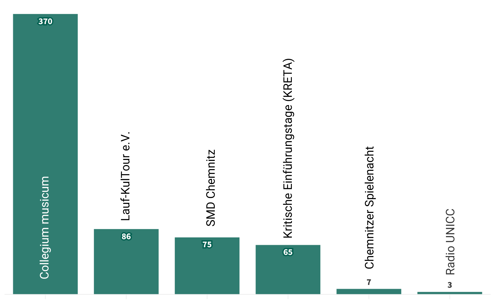

_work-in-progress_

# C the Unheard!

**Datenbasierte Kartierungen zivilgesellschaftlicher Diskurse in Chemnitz**

Das Projektvorhaben widmet sich einer datenbasierten Kartierung zivilgesellschaftlicher Diskurse in Chemnitz. Zivilgesellschaftliche Aktivitäten prägen nicht nur die Chemnitzer Stadtöffentlichkeit sondern auch das Campusleben der TUC nachhaltig. Bisher gibt es keine Datensammlung, die das vielfältige Engagement zivilgesellschaftlicher Akteure dokumentiert und sichtbar macht. Hier setzt das Projekt mit der Erstellung einer offenen Datensammlung an, die mit zivilgesellschaftlichen Projektpartnern, Studierenden und Bürger*innen erarbeitet und exploriert wird.

## Initiativen und Vereine in Chemnitz 

Chemnitz lebt vom zivilgesellschaftlichen Engagement seiner Bürge*innen, das in zahlreichen Vereinen und Initiativen sichtbar wird. Die Visualisierung zeigt eine erste Verteilung und das Verhältnis der im Rahmen des Projekts untersuchten Vereine und Initiativen in Chemnitz. Die Datensammlung stellt dabei lediglich einen exemplarischen, jedoch nicht vollständigen Ausschnitt der Vereine und Initiativen in Chemnitz dar. 

Sportvereine (154), der Stadtverband Chemnitz der Kleingärtner e.V. (179) und Angebote der kulturellen Bildung (138) decken gemeinsam mehr als 90% des Vereinslebens in Chemnitz ab. Die Bedeutung des Sports wird unter anderem durch das Vorhandensein von insgesamt 133 Sporteinrichtungen unterstrichen, die überall in der Stadt zu finden sind. Die Kleingartenbewegung in Chemnitz blickt auf eine lange Geschichte zurück. So wurde beispielsweise im Zeitraum von 1920 bis 1937 die Gartenstadt Gablenz entwickelt, die nicht nur grünen Freiraum schaffen sollte, sondern auch ein neues Modell des städtischen Zusammenlebens darstellt. Mit einem Anteil von ca. 3,7% an der [Gesamtbevölkerung von Chemnitz](https://www.chemnitz.de/chemnitz/de/unsere-stadt/stadtportrait/zahlen-und-fakten/bevoelkerung.html) wird ferner deutlich, dass das ehrenamtliche Engagement von Studierenden der TU eine große Rolle spielt. 

_Erstellt mit Excel_

Die Geschichte des Vereinslebens sowie des studentischen Engagements in Chemnitz ist von einer langen Tradition geprägt. Die Visualisierung veranschaulicht die Gründungsjahre von Vereinen und studentischen Initiativen entlang einer Zeitleiste von 1950 bis 2030. Jede Raute repräsentiert dabei die Gründung eines Vereins oder einer Initiative, ihre Größe symbolisiert die Anzahl der Neugründungen in einem bestimmten Jahr. Auffällig ist insbesondere der Anstieg der städtischen Vereinsgründungen nach 1990. Dieser Anstieg lässt sich auf das Inkrafttreten des [Gesetzes über Vereinigungen](https://www.verfassungen.de/ddr/vereinigungsgesetz90.html) in der ehemaligen DDR am 21. Februar 1990 zurückführen. Dieses Gesetz, ein direktes Ergebnis der politischen Liberalisierung während der Wendezeit, machte die Gründung neuer Vereine einfacher und erforderte zugleich von bestehenden Organisationen eine Neuregistrierung und die Anpassung ihrer Satzungen an die neuen rechtlichen Rahmenbedingungen. Im Jahr 1991 wurden 98 Neugründungen städtischer Vereine registriert. Die Welle der Vereinsgründungen in dieser Zeit deutet auf die gesellschaftlichen und sozialen Transformationsprozesse der Wendezeit hin. 

## Anerkannte studentische Initiativen an der TU Chemnitz

_Erstellt mit flourish.studio_

Die Visualisierung zeigt eine Zeitleiste mit den Gründungsjahren der studentischen Initiativen von 1950 bis 2030. Mit 2015 und 2022 lassen sich zwei besonders aktive Gründungsjahre identifizieren, in denen jeweils drei Initiativen ins Leben gerufen wurden. Subbotnik e.V., T.U.C. Racing e.V. und ROCK YOUR LIFE! Chemnitz e.V. wurden im Jahr 2015 gegründet und erweitern das kulturelle, soziale und technische Angebot studentischer Initiativen an der TUC. Im Jahr 2022 folgten dann TUC tanzt, der Ring christlich-demokratischer Studenten (RCDS) und die Kritischen Einführungstage (KRETA), die eine weitere Diversifizierung und thematische Breite aufzeigen. Die älteste noch bestehende Initiative, die Katholische Studierenden Gemeinde Chemnitz (KSG), wurde bereits 1952 gegründet. Der THEORIE Lesekreis hingegen wurde erst im Jahr 2024 gegründet und kann demgemäß als relativ jung bezeichnet werden. Die Visualisierung zeigt eine Zeitleiste mit den Gründungsjahren der studentischen Initiativen von 1950 bis 2030. 2015 und 2022 waren mit jeweils drei Initiativen die gründungsreichsten Jahre. 

_Erstellt mit Palladio @OpenStreetMap contributors_

Die Visualisierung zeigt die geografische Verteilung der studentischen Initiativen in Chemnitz. Die Größe der Punkte korreliert mit der Anzahl der Initiativen an einem bestimmten Standort. Besonders auffällig ist die Konzentration der Initiativen am TU Campus Reichenhainer Straße oder am Universitätsstandort Straße der Nationen. Diese Clusterbildung spiegelt die wichtige Rolle der Universität als Knotenpunkt für studentisches Engagement wider und unterstreicht die Bedeutung der räumlichen Nähe zur Hochschulgemeinschaft.

Gleichzeitig zeigt die Verteilung aber auch, dass einige Initiativen über die unmittelbare universitäre Umgebung hinaus aktiv sind. Einige Initiativen befinden sich auf dem Kaßberg, in der Nähe der Bibliothek oder im Stadtzentrum. So werden auch städtische Räume genutzt, um unterschiedliche Interessen und Aktivitäten zu entfalten. Campus- und Stadtöffentlichkeit sind also miteinander vernetzt.

## Veranstaltungsorte

_Erstellt mit flourish.studio_

Im Rahmen des Projekts wurden insgesamt 956 Veranstaltungen untersucht, die von studentischen Initiativen der TUC durchgeführt wurden. Innerhalb des untersuchten Zeitraums ist festzustellen, dass die Mehrheit der Initiativen (nämlich neun von elf) keine Aktivitäten außerhalb der Grenzen der Bundesrepublik Deutschland durchgeführt hat. Lediglich das Collegium musicum und die SMD Chemnitz sind in dem zugrundeliegenden Datensatz mit Veranstaltungen im Ausland gelistet. 

_Erstellt mit flourish.studio_

Das Sankey-Diagramm bietet nun einen detaillierten Überblick über die im Ausland stattgefundenen Veranstaltungen. Im untersuchten Zeitraum von 1967 bis 2024 war insbesondere das Collegium musicum international aktiv. Insgesamt gab es 28 Auftritte in verschiedenen Ländern. Die Auftritte konzentrierten sich einerseits auf geografisch nahegelegene europäische Nachbarländer, wie Frankreich, Niederlande, Italien und die Schweiz, andererseits spielte das Universitätsorchester auch in Japan und Schweden. Die SMD Chemnitz veranstaltete im selben Zeitraum Exkursionen und Freizeiten, die sie nach Portugal und in die Schweiz führten.

_Erstellt mit flourish.studio_

Das Sankey-Diagramm präsentiert eine weitere Detailansicht, welche die Städte umfasst, in denen das Collegium musicum öffentlich aufgetreten ist. Es kann also festgehalten werden, dass etwa zwei Drittel der Auftritte in Chemnitz selbst stattfanden. Hierbei handelte es sich beispielsweise um Weihnachtskonzerte oder Auftritte bei universitären Veranstaltungen wie Immatikulationsfeiern. Augustusburg im Erzgebirge ist die Stadt, in der die Musiker*innen am zweithäufigsten auftraten. Über die Jahrzehnte hinweg diente das dortige [Renaissanceschloss](https://www.augustusburg-schloss.de/) als Veranstaltungsort. Der Großteil der Städte wurde jedoch nur einmalig bei Konzertreisen angesteuert, darunter Bayreuth, Witzendorf, Neapel oder Seto.

_Erstellt mit flourish.studio_

Das Diagramm veranschaulicht, in welchen Städten die von studentischen Initiativen organisierten Veranstaltungen stattfanden. Wie zu erwarten, ist Chemnitz mit 773 Veranstaltungen der mit Abstand häufigste Veranstaltungsort. Initiativen wie Subbotnik, die Kritischen Einführungstage (KRETA) oder die Chemnitzer Spielenacht haben sämtliche ihrer Aktivitäten in Chemnitz durchgeführt, was die starke lokale Verankerung dieser Initiativen widerspiegelt. 
Ein Beispiel für eine Initiative mit überregionaler Ausrichtung ist Lauf-KulTour e.V. Als einzige Initiative hat Laufkultur e. V. mehr Veranstaltungen außerhalb Chemnitz angeboten. Die sportlichen Wettkämpfe führten die Initiative unter anderem nach Meißen, Freiberg, Zittau und Marburg. Es ist jedoch darauf hinzuweisen, dass diese Analyse sich auf die auf der Webseite der Initiative dokumentierten Wettkämpfe beschränkt. Wöchentlich stattfindende Trainingseinheiten, die überwiegend in Chemnitz abgehalten werden, sind in dieser Auswertung nicht berücksichtigt.

## Veranstaltungen zwischen 1967-2024

Veranstaltungen studentischer Initiativen sind ein zentraler Bestandteil des Campuslebens. Sie schaffen Gelegenheiten für Austausch zwischen Studierenden und Bürger*innen, fördern Gemeinschaft und tragen aktiv zur kulturellen und sozialen Gestaltung von Chemnitz bei. Das im Rahmen des Projekts erstellte Veranstaltungsarchiv studentischer Initiativen der TU Chemnitz reicht bis in die 1960er Jahre zurück. Die folgenden Visualisierungen geben einen Überblick der stattgefundenen Veranstaltungen, zeigen die Initiativen auf und stellen deren Aktivitäten quantitativ dar. 

_Erstellt mit flourish.studio_

Das Balkendiagramm zeigt die Anzahl der dokumentierten Veranstaltungen pro Initiative im Zeitraum von 1967 bis 2023. Hervorzuheben ist das Collegium Musicum, das mit 370 Veranstaltungen die meisten Aktivitäten in diesem Zeitraum verzeichnet. Im Vergleich dazu weisen Initiativen wie Lauf-KulTour e.V. (86 Veranstaltungen) oder SMD Chemnitz (75 Veranstaltungen) weniger Veranstaltungen auf.   

Es ist jedoch wichtig zu berücksichtigen, dass in der Datensammlung nicht alle Veranstaltungen der studentischen Initiativen repräsentiert sind. Einige der studentischen Initiativen verfügen über aktuelle Veranstaltungskalender, die      sich beispielsweise auf den laufenden Monat beschränken. Diese Initiativen sind im Zeitraum von 1967 bis 2023 unterrepräsentiert. In diesem Kontext gewinnen nicht nur Fragen zur Datenerhebung an Bedeutung, sondern auch die Herausforderungen, denen sich studentische Initiativen gegenüberstehen, wenn es darum geht, Daten auf nachhaltige Weise bereitzustellen.

_Erstellt mit flourish.studio_

Im Gegensatz zur vorherigen Visualisierung, die nur sechs Initiativen zeigte, listet dieses Balkendiagramm 13 Initiativen und umfasst nun auch das Jahr 2024, in dem die Datensammlung erstellt wurde.
Allerdings ist auch hier zu beachten , dass für einige Initiativen wie Radio UNiCC, Subbotnik und das Projekt Lesezeichen lediglich Veranstaltungen aus einem kurzen Zeitraum von zwei Monaten erfasst wurden. Diese zeitliche Einschränkung führt dazu, dass diese Initiativen in dieser Visualisierung unterrepräsentiert erscheinen, da ihre langfristigen Aktivitäten nicht vollständig dokumentiert sind. Das Balkendiagramm dient daher nicht dem Vergleich der Aktivitäten der Initiativen, sondern eher als Hinweis auf die verfügbaren Datenbestände und deren zeitliche Reichweite.

_Erstellt mit flourish.studio_

Das Diagramm zeigt die jährliche Anzahl der dokumentierten Veranstaltungen ausgewählter studentischer Initiativen. Besonders hervorzuheben ist wieder das Collegium Musicum, das als einzige Initiative eine konstante Veranstaltungszahl über mehrere Jahrzehnte hinweg aufweist. Im Gegensatz dazu wird deutlich, dass die meisten anderen Initiativen erst zur Jahrtausendwende mit der Durchführung von Veranstaltungen begonnen haben oder frühere Veranstaltungen erst ab diesem Zeitpunkt auf ihren Internetseiten dokumentieren. Beispiele wie Lauf-KulTour e.V., SMD Chemnitz oder Radio UNiCC zeigen erst ab den 2000er Jahren einen deutlichen Anstieg an Aktivitäten, was auf eine spätere Gründung oder eine systematischere Archivierung hindeutet. 

_Erstellt mit flourish.studio_

Diese Visualisierung bietet einen detaillierten Einblick in die Veranstaltungszahlen der Jahre 2018 bis 2023 und zeigt zwei zentrale Entwicklungen auf: 1.) Im Gegensatz zu früheren Jahren ist das Collegium Musicum in diesem kurzen Zeitraum nicht die Initiative mit den meisten Veranstaltungen pro Jahr. 2.) Die Visualisierung zeigt einen drastischen Rückgang der Veranstaltungszahlen in den Jahren 2020 und 2021. Der Einbruch ist eine unmittelbare Konsequenz der Maßnahmen zur Eindämmung der Covid-19-Pandemie, welche mit umfassenden Einschränkungen im Veranstaltungsbereich einhergingen. Die Visualisierung veranschaulicht auch, dass sich die Situation im Jahr 2022 mit den bundesweiten Lockerungen deutlich verbessert hat. Dies lässt sich auf die Wiederaufnahme zahlreicher Aktivitäten sowie das verstärkte Engagement verschiedener Initiativen zurückführen. 

## Veranstaltungen im April 2024

Aber wann finden eigentlich studentische Veranstaltungen statt – und welche Muster lassen sich erkennen? Auf einer Mikroebene wird nachfolgend der Monat April im Jahr 2024 untersucht. Die Datenanalyse zeigt , welche Initiativen wie viele Veranstaltungen angeboten haben , wie sich diese zwischen Werktagen und Wochenenden verteilen und welche Wochentage besonders beliebt für studentische Veranstaltungen sind. 

_Erstellt mit flourish.studio_

Das Säulendiagramm zeigt die aktiven Initiativen in diesem Monat mit der Anzahl der von ihnen ausgetragenen Veranstaltungen. Im Unterschied zu den bisherigen Visualisierungen taucht das Collegium musicum in diesem Balkendiagramm nicht auf. Stattdessen tritt das Radio  UNiCC als Akteur mit den meisten Veranstaltungen im Monat auf (79). Das studentische Radio bietet den Zuhörenden ein vielfältiges Programm, das sich aus Wissens- und Musiksendungen zusammensetzt. Dass die Kritischen Einführungstage und das Patenprogramm des International Office gelistet sind, ist ein Zeichen für den Anfang des Semesters. Im April finden Einführungsveranstaltungen für die neuen Studierenden statt, welche unter anderem von diesen beiden Initiativen organisiert werden.

_Erstellt mit flourish.studio_

Die Visualisierung bietet eine taggenaue Übersicht über die im April durchgeführten Veranstaltungen. Jeder Initiative wurde eine individuelle Farbe zugeordnet, welche die Anzahl der an einem Tag ausgetragenen Veranstaltungen widerspiegelt.
Deutlich sind die Einbrüche an den Wochenenden zu erkennen, an denen lediglich das Radio  UNiCC regelmäßig auf Sendung war. Die restlichen Initiativen (besonders Subbotnik e.V. und AGIUA e.V., Projekt LESEZEICHEN) lassen ihre wöchentlich wiederkehrenden Veranstaltungen an den Werktagen stattfinden. 
Die Detailansicht unterstreicht die zahlenmäßige Ungenauigkeit der Gesamtanzahl von Veranstaltungen zwischen 1967 und 2024, welche bereits zuvor beschrieben wurde. Von Subbotnik e.V., dem Projekt LESEZEICHEN und dem Radio UNiCC konnten jeweils nur ein bzw. zwei Monate der vergangenen Veranstaltungen in die Datensammlung aufgenommen werden, darunter der hier gezeigte April 2024.

_Erstellt mit flourish.studio_

Präziser als die vorherige Visualisierung veranschaulichen diese beiden Säulendiagramme die Wochentage, an denen die Veranstaltungen studentischer Initiativen stattgefunden haben. Es wird deutlich, dass der Mittwoch mit 43 Veranstaltungen der bevorzugte Tag für studentische Aktivitäten war. Bei einer Hochrechnung auf die vier Mittwoche des Monats ergibt sich ein Durchschnitt von zehn bis elf Veranstaltungen pro Mittwoch, was einer beachtlichen Dichte an Angeboten entspricht. Ein Trend ist mit Blick auf das Wochenende zu beobachten: Schon an Freitagen ist die Anzahl der Veranstaltungen mit insgesamt 22 Terminen vergleichsweise niedrig. An Samstagen (6 Veranstaltungen) und an Sonntagen (7 Veranstaltungen) fällt die Zahl nochmals deutlich ab. 

Eine deutliche Differenz zeigt sich in der Anzahl der Veranstaltungen zwischen Werktagen und Wochenenden: An Werktagen fanden etwa 13-mal so viele Veranstaltungen statt wie an den Wochenendtagen. Dies lässt sich zum einen damit begründen, dass es fünf Werktage, jedoch nur zwei Wochenendtage gibt. Zum anderen lässt es aber auch eine Hypothese über die Zielgruppe zu: Studierende sind an den Wochenenden weniger in Chemnitz, da sie Familie / Freund*innen in anderen Städten besuchen. Dadurch sinkt das potenzielle Publikum für Veranstaltungen, was Initiativen dazu bewegen könnte, ihre Aktivitäten überwiegend auf die Werktage zu konzentrieren, an denen die Studierenden vermehrt vor Ort sind. 

_Erstellt mit Palladio @OpenStreetMap contributors_

Die Karte veranschaulicht, an welchen Orten im April 2024 Veranstaltungen studentischer Initiativen stattfanden. Jeder Punkt steht für einen Austragungsort und seine Größe beschreibt die Häufigkeit, wie oft dieser Ort genutzt wurde. Die Hotspots des studentischen Lebens lagen in der Chemnitzer Innenstadt, dem Campus an der Reichenhainer Straße sowie im Areal rund um den Universitätsstandort an der Straße der Nationen. Vereinzelt haben Veranstaltungen auf dem Kaßberg und in Furth stattgefunden, keine der Veranstaltungen im April 2024 war jedoch außerhalb Chemnitz.

## Wiederkehrende Angebote

Untersucht wurden neben den Veranstaltungen der studentischen Initiativen auch ihre wiederkehrenden Angebote, welche in der untenstehenden Word-Cloud zusammengefasst sind. 

_Erstellt mit flourish.studio_

Diese Angebote konzentrieren sich überwiegend auf den sozialen Austausch. Beispiele hierfür sind Bowling, Grillen, Wichteln, Spieleabende oder Kochduelle. Einige dieser Angebote sind saisonabhängig und an bestimmte Zeiten im Jahr gekoppelt, wie etwa Eislaufen, Hexenfeuer, Sommerfeste oder Weihnachtsfeiern. Nur selten gibt es bei den wiederkehrenden Angeboten einen inhaltlichen Bezug zur Initiative (bspw. Chorreisen, Konzert, qualifizierte Beratung).

## Datengrundlage

- Stadtsportbund Chemnitz e.V., „Willkommen im Chemnitzer Sport“, https://www.sport-in-chemnitz.de/sportangebote/ [zuletzt aufgerufen am 13.12.2024].
- Stadt Chemnitz, „Kulturelle Bildung Chemnitz“, https://www.kulturelle-bildung-chemnitz.de/de/Angebotssuche_1213.html [zuletzt aufgerufen am 13.12.2024].
- Stadtverband Chemnitz der Kleingärtner e.V., „Mitgliedsvereine“, https://stadtverband-chemnitz.de/mitgliedsvereine.html [zuletzt aufgerufen am 13.12.2024].
- Student_innen Rat der TU Chemnitz, „Anerkannte stud. Initiativen des Student_innenrates“, aktualisiert am 26.07.2024, https://www.stura.tu-chemnitz.de/initiativen [zuletzt aufgerufen am 13.12.2024].
- Stadt Chemnitz, „Sporteinrichtungen“, aktualisiert am 09.10.2024, https://portal-chemnitz.opendata.arcgis.com/datasets/efd8c6dd60c54ffb8c05e7b1a867b54f_0/explore?location=50.822380%2C12.887629%2C11.60&showTable=true [zuletzt aufgerufen am 13.12.2024].

Weitere Quellen:
Bahr, Wolfgang, Jörn Richter, und Chemnitzer Allgemeine Wohnungsbaugenossenschaft, Hrsg. 2002. Gartenstadt Gablenzsiedlung Chemnitz: Entstehung, Geschichte und Sanierung einer Genossenschaftssiedlung. Chemnitz: Verl. Heimatland Sachsen GmbH Chemnitz.

